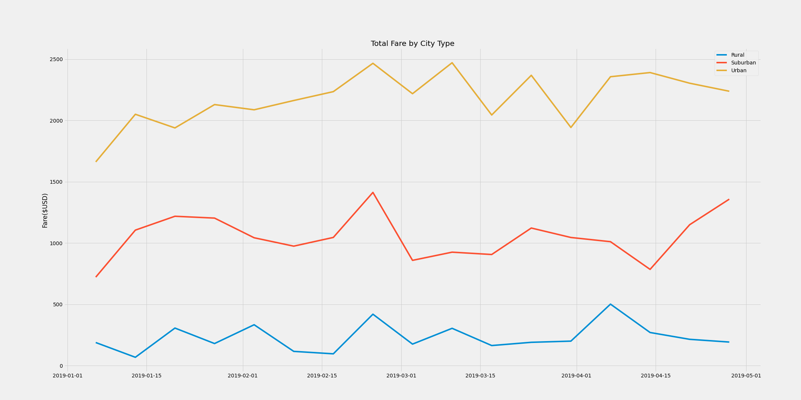

# PyBer_Analysis

## Overview of the Project
We have applied Python skills and knowledge of Pandas to give a better view of total fares by city type by giving out a summary DataFrame for the ride-sharing data and a multiple-line graph that show the total weekly fares for each city type. We could have a actionable insight by the analysis result.

## Results
### PyBer Summary DataFrame

As we can see from the PyBer summary, we have the most rides drivers and fares in urban area, but the lowest average fare per ride and per driver, they are only $24.53 and $16.57 respectively. For urban area, we can see we have 2405 drivers but only 1625 rides which leads to the result of lowest average fares per ride and per driver. For rural area, we have the least total rides and drivers, but it contributes the highest average fare per ride and per driver for $34.62 and $55.49 respectively. The total ride number is almost double for the number of drivers.It means there is more potential in rural area. As for the suburan area, it has almost 2.5 times average fare per driver comparing with the urban area and it performs better than urban area.

### Multiple-line chart

From the multiple-line chart, we can see clearly that the 

Overview of the analysis: Explain the purpose of the new analysis.
Results: Using images from the summary DataFrame and multiple-line chart, describe the differences in ride-sharing data among the different city types.
Summary: Based on the results, provide three business recommendations to the CEO for addressing any disparities among the city types.

Results:

There is a description of the differences in ride-sharing data among the different city types. Ride-sharing data include the total rides, total drivers, total fares, average fare per ride and driver, and total fare by city type. (7 pt)
Summary:

There is a statement summarizing three business recommendations to the CEO for addressing any disparities among the city types. (4 pt)
