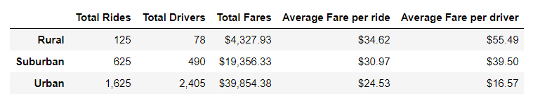
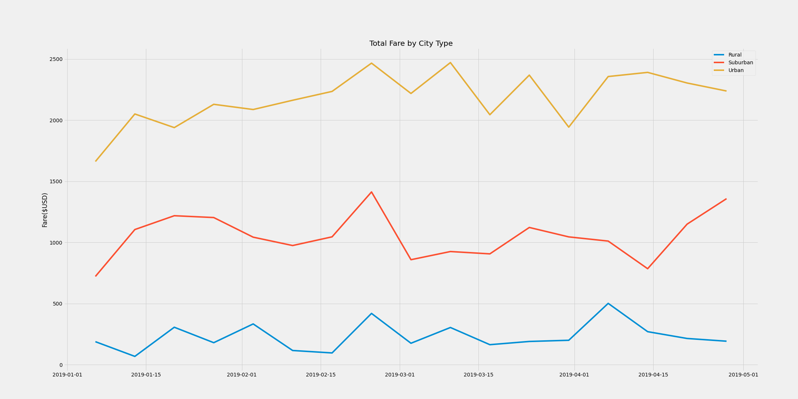

# PyBer_Analysis

## Overview of the Project
We have applied Python skills and knowledge of Pandas to give a better view of total fares by city type by giving out a summary DataFrame for the ride-sharing data and a multiple-line graph that show the total weekly fares for each city type. We could have a actionable insight by the analysis result.

## Results
### PyBer Summary DataFrame

As we can see from the PyBer summary, we have the most rides drivers and fares in urban area, but the lowest average fare per ride and per driver, they are only $24.53 and $16.57 respectively. For urban area, we can see we have 2405 drivers but only 1625 rides which leads to the result of lowest average fares per ride and per driver. For rural area, we have the least total rides and drivers, but it contributes the highest average fare per ride and per driver for $34.62 and $55.49 respectively. The total ride number is almost double for the number of drivers.It means there is more potential in rural area. As for the suburan area, it has almost 2.5 times average fare per driver comparing with the urban area and it performs better than urban area.

### Multiple-line chart

From the multiple-line chart, we can see clearly that the total fares from  urban area is much higher than the rest of two regions. Most of the time, the fares from urban area is more than $2000 and less than $2500. On the other side, the total fares in rural area has the lowest fares which are around $250 from January to April. The total fares from all city type reached the peak in Feburary. As for the suburan area, it has the average perfromance that total fares from January to April stay around $1000 in this four month.

## Summary
Base on the analysis of the total fares by city types, we have the following suggestions to CEO of PyBer:
* We should have less drivers in urban area since there are about 800 drivers did not have even a single ride. We do not need that amount of drivers in urban area. There are too many drivers comparing with the demand in urban area. Cutting down the number of drivers would save the cost and increase the average fare per driver and per ride significantly.
* We should send hired more drivers in rural area, the number of total rides is amlost double of the number of total drivers. It indicates that there is more potential in rural area and having more drivers could possbily increase the fare.
* We do not need to change much about suburban area. There are enough drivers for the rides, and the average fare per ride is much better than the average fare of urban area. 

